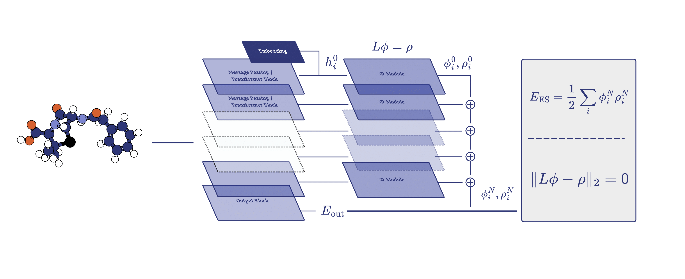

# Φ-Module

This repository provides the official implementation and training pipeline for the paper [**Electrostatics from Laplacian Eigenbasis for Neural Network Interatomic Potentials**](https://arxiv.org/pdf/2505.14606).



---

## 🌌 Introduction

Neural network interatomic potentials have achieved remarkable accuracy in quantum chemistry. However, most models fail to capture **long-range electrostatic interactions** due to their inherently local message-passing nature.

We propose **Φ-Module**, a universal and lightweight plugin that:

- Enforces latent **Poisson's equation** using the **Laplacian eigenbasis**.
- Learns **electrostatic potential** (ϕ) and **partial charges** (ρ) self-supervised, without labeled charges.
- Augments baseline GNN potentials with an electrostatic energy term:
- Improves accuracy on OE62 and MD22 benchmarks while being memory-efficient and hyperparameter-stable.

---

## ⚙️ Environment Setup

You can run the code using either **Conda** or **Docker**:

### 📦 Conda Setup

We provide `env.yml` to create a reproducible Python environment.

#### 🔧 Steps

```bash
# Step 1: Create the environment
conda env create -f env.yml

# Step 2: Activate the environment
conda activate phi-module
```

This installs PyTorch, PyTorch Geometric, RDKit, ASE, and other dependencies.

### 🐳 Docker Setup

Alternatively, use the provided `Dockerfile` for an isolated container setup. Make sure Docker has NVIDIA GPU support enabled.

## 📁 Datasets

### OE62

- Organic molecules (~41 atoms on average)
- 61,489 entries with DFT-calculated total energies
- Used for energy prediction

OE62 can be downloaded from [TUM website](https://mediatum.ub.tum.de/1507656). Then, the dataset has to be processed into corresponding splits using `oe62_preprocessing.py` file.

### MD22

- Molecular dynamics trajectories (7 large molecules)
- Up to 85,000 frames and 370 atoms
- Used for energy and force prediction

MD22 can be obtained from [sGDML website](http://docs.sgdml.org/datasets.html).

## 🚀 Training

Train any supported baseline model (SchNet, DimeNet++, PaiNN, etc.) with Φ-Module by running corresponding command with a sutable config. 
Make sure the paths inside configs are correct.

```bash
python3 main.py --config "$CONFIG_FILE" --seed "$seed"
```

## 📝 Citation

If you used this code for your research or a project, please cite us as:

```bash
@misc{zhdanov2025electrostaticslaplacianeigenbasisneural,
      title={Electrostatics from Laplacian Eigenbasis for Neural Network Interatomic Potentials}, 
      author={Maksim Zhdanov and Vladislav Kurenkov},
      year={2025},
      eprint={2505.14606},
      archivePrefix={arXiv},
      primaryClass={cs.LG},
      url={https://arxiv.org/abs/2505.14606}, 
}
```


